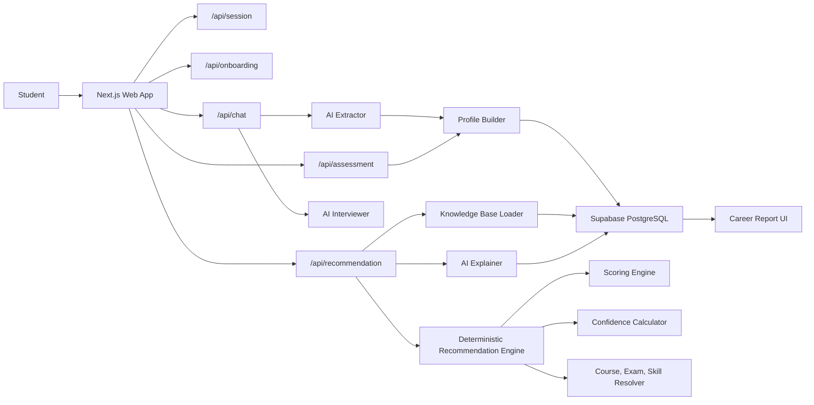
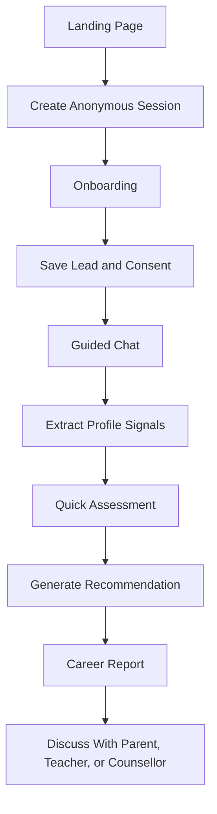
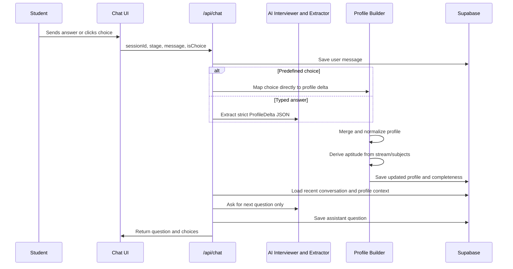
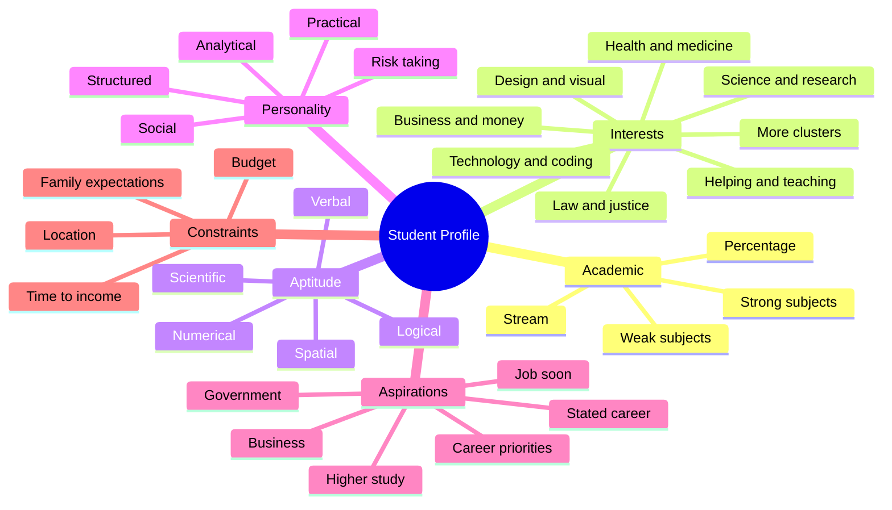
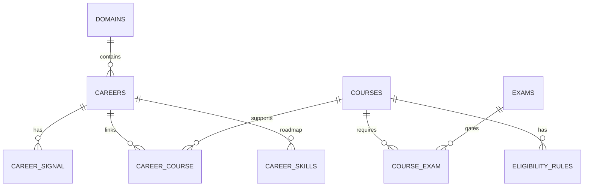
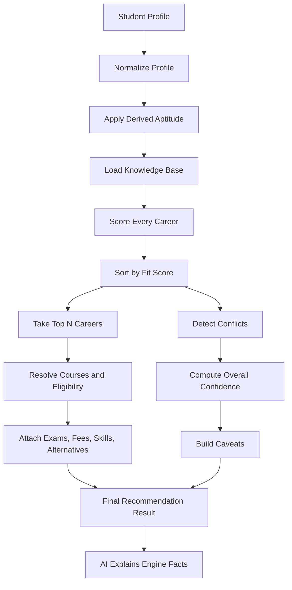
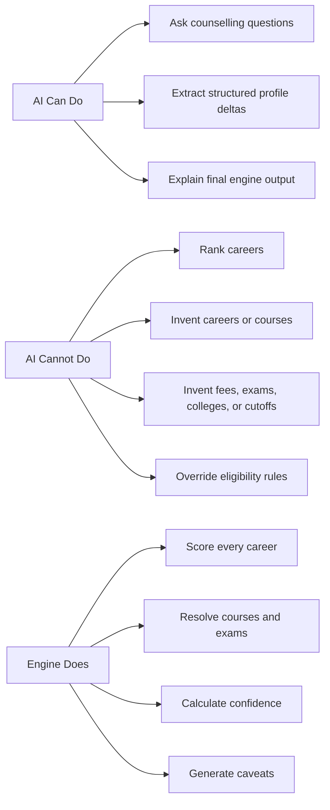

# PathFinder Platform Working and Recommendation Logic

## Executive Summary

PathFinder is an AI-assisted career guidance platform for Plus Two students in Kerala / India. It helps a student move from basic onboarding to a guided counselling conversation, then produces a career report with ranked career paths, course routes, entrance exams, skill roadmap, alternatives, confidence, and caveats.

The most important design principle is simple:

> The AI does not decide the recommendation. The AI interviews, extracts structured signals, reviews, and explains. The deterministic recommendation engine makes the final ranking from the verified knowledge base.

This keeps the platform professional, auditable, and safer for students. Career names, course routes, exams, fee bands, and eligibility rules come from the knowledge base, not from AI imagination.

---

## What the Platform Is

PathFinder is a full-stack web application that works like a structured digital career counsellor.

It collects:

- Student details such as age, district, stream, percentage, and preferred language.
- Career interest signals from chat.
- Academic strengths and derived aptitude signals.
- Goal orientation such as higher study, job soon, government exams, or business.
- Practical constraints such as budget, location, relocation, and family expectations.
- Optional quick assessment signals.

It then turns those inputs into:

- Top career recommendations.
- Fit score for each career.
- Confidence score for the ranking.
- Course routes for each career.
- Eligibility status and entrance exams.
- Skill roadmap.
- Alternatives and caveats.
- AI-written explanation based only on engine results.

---

## Technology Stack

| Layer | Technology | Purpose |
|---|---|---|
| Frontend | Next.js App Router, React, TypeScript | Student UI, chat screen, onboarding, result report, admin pages |
| Styling | Tailwind CSS, shadcn-style UI primitives | Clean responsive interface |
| Backend | Next.js API Routes | Session, onboarding, chat, profile, assessment, and recommendation APIs |
| Database | Supabase PostgreSQL | Sessions, leads, conversations, profiles, assessments, recommendations, knowledge base |
| AI Model | Groq Llama 3.3 70B Versatile | Chat question generation, profile extraction, recommendation explanation |
| Validation | Zod, TypeScript types | Request validation and controlled data shapes |
| Security | Server-only Supabase service role, RLS policies, hashed IPs, audit log | Protect PII and sensitive operations |
| Deployment Target | Vercel | Full-stack app hosting |

---

## Platform Architecture



The application is stateless at the server route level. Session state, conversations, profile data, and recommendations are stored in Supabase, so page refreshes and serverless function restarts do not lose the student's progress.

---

## User Journey



### 1. Session Creation

The platform creates an anonymous session first. This allows the student journey to start before the platform has personal information.

### 2. Onboarding

The onboarding form collects student details and consent. Personal information is stored in the `leads` table. Academic information such as stream and percentage is also used to seed the structured profile.

For minors, guardian consent is required and stored with timestamp and consent version.

### 3. Guided Chat

The chatbot asks targeted questions across three stages:

- Direction and interests.
- Goals and career values.
- Practical constraints.

The chat is designed to finish in a limited number of turns while still collecting enough signals for a meaningful recommendation.

### 4. Quick Assessment

After the chat, the platform can ask a short set of aptitude or personality questions. These answers are saved and merged into the student profile.

### 5. Recommendation Report

The recommendation API loads the student profile, loads the verified knowledge base, runs the deterministic engine, asks AI only to explain the result, stores the recommendation, and shows the final report.

---

## How the Chatbot Works

The chatbot has three separate AI roles:

| AI Role | What It Does | What It Must Not Do |
|---|---|---|
| Interviewer | Asks the next counselling question | Must not recommend careers |
| Extractor | Converts the student's reply into structured profile data | Must not invent missing signals |
| Explainer | Explains the final engine result in simple language | Must not create new careers, courses, fees, or exams |

### Chatbot Flow



### Why the Chatbot Is Controlled

The chatbot is intentionally restricted because career advice can strongly influence a student's future. The code adds controls such as:

- One question per turn.
- Simple student-friendly wording.
- Questions based on the current profile gaps.
- No career recommendation inside the chat.
- No college, fee, or cutoff claims from the AI.
- Controlled vocabularies for interests, aptitude, personality, goals, budget, and location.
- Low-content replies such as "ok", "not sure", or "anything" are skipped for extraction to avoid fake profile signals.
- Predefined buttons are mapped directly to profile data where possible, reducing AI latency and extraction errors.

### Profile Signals Collected



---

## Knowledge Base

The knowledge base is the platform's source of truth. It stores the facts and matching weights used by the engine.



It includes:

- Domains such as computing, medical, law, commerce, humanities, design, and engineering.
- Careers such as software engineer, doctor, teacher, lawyer, and others.
- Courses such as BTech, BSc, BCom, BA, MBBS, diplomas, and professional routes.
- Exams such as KEAM, NEET, CUET, CLAT, or other cataloged exams.
- Eligibility rules based on stream, subjects, marks, age, and other constraints.
- Career signals that connect each career to interests, aptitude, and personality.
- Skill roadmap from foundation to advanced stage.

---

## How Recommendations Are Formed

The recommendation system has four major steps:

1. Prepare the student's structured profile.
2. Score every published career.
3. Build full recommendation objects for the top careers.
4. Compute confidence and caveats.



### Step 1: Profile Preparation

The profile builder normalizes partial profile data into a complete shape. This prevents missing sections from breaking the engine.

It also derives aptitude from academic signals. For example:

- Strong Mathematics can infer numerical, logical, and spatial aptitude.
- Strong Biology can infer scientific aptitude.
- Strong Computer Science can infer logical and numerical aptitude.
- If no subject is known, stream gives a weaker baseline.

The derived values never lower existing observed values. They only fill gaps or strengthen a signal.

### Step 2: Hard Eligibility Check

Course eligibility is evaluated using rules from the knowledge base.

The engine checks:

- Required stream.
- Age limits.
- Minimum aggregate marks.
- Other course constraints.

Important behavior:

- Wrong stream can make a course ineligible.
- Marks below a threshold make the route conditional, not automatically rejected.
- Fallback course routes can still appear when they are useful for exploration.

### Step 3: Career Fit Scoring

Each career is scored across six dimensions.

| Dimension | Weight | Meaning |
|---|---:|---|
| Interest | 30% | Does the student's interest match the career's interest signals? |
| Aptitude | 25% | Do the student's numerical, logical, verbal, spatial, or scientific strengths match? |
| Academic | 15% | Do strong subjects and stream fit the career domain? |
| Personality | 10% | Do work-style traits align with the career? |
| Aspiration | 10% | Does the career match the student's goal, such as higher study or job soon? |
| Constraint | 10% | Does the career fit budget or time-to-income needs? |

The engine does not punish the student for missing data. If a dimension was not measured, that dimension is excluded and the remaining weights are renormalized.

### Fit Score Formula

At a high level:

```text
fitScore =
  sum(measuredDimensionScore * dimensionWeight)
  / sum(measuredDimensionWeights)
```

The score is then clamped between 0 and 1.

Example:

```text
Interest score     = 0.90 with weight 0.30
Aptitude score     = 0.80 with weight 0.25
Academic score     = 0.85 with weight 0.15
Personality score  = 0.65 with weight 0.10
Aspiration score   = 0.75 with weight 0.10
Constraint score   = 0.70 with weight 0.10

fitScore =
(0.90*0.30 + 0.80*0.25 + 0.85*0.15 + 0.65*0.10 + 0.75*0.10 + 0.70*0.10)
/ 1.00
= 0.8075

Displayed fit = 81%
```

### Step 4: Course, Exam, and Skill Resolution

For each top career, the engine resolves:

- Primary course routes.
- Alternative routes.
- Higher-study routes.
- Fallback routes.
- Eligibility status.
- Relevant exams.
- Typical fee band.
- Skill roadmap.
- Related career alternatives in the same domain.

The route priority is:

1. Primary.
2. Alternative.
3. Higher-study route.
4. Fallback.

### Step 5: Confidence Score

Confidence is separate from fit score.

Fit score answers:

> How well does this career match the profile?

Confidence answers:

> How much should we trust this ranking?

The confidence calculator uses:

- Profile completeness.
- Strength of the top fit score.
- Gap between the first and second ranked careers.
- Conflict penalties.

```text
baseConfidence =
  0.45 * profileCompleteness
+ 0.30 * topScore
+ 0.25 * rankingMargin
- conflictPenalties
```

Ranking margin becomes stronger when the top career clearly beats the runner-up. If the top two careers are very close, confidence is lower because the system sees a near tie.

### Step 6: Caveats

Caveats are added when:

- The profile is incomplete.
- Confidence is moderate.
- Interest conflicts with marks or aptitude.
- The student's stated career is not covered by the knowledge base.
- The result should be discussed with a counsellor or family.

This makes the recommendation honest instead of overconfident.

---

## AI vs Engine Responsibilities



This boundary is the foundation of the platform's reliability.

---

## Database Overview

| Table | Purpose |
|---|---|
| `sessions` | Tracks one user journey from start to completion |
| `leads` | Stores personal information, academic details, consent, and funnel status |
| `conversations` | Stores assistant and student chat turns |
| `student_profiles` | Stores structured profile JSON and completeness |
| `assessment_responses` | Stores item-level assessment answers |
| `recommendations` | Stores final ranked recommendation output and explanation |
| `domains` | Top-level career domains |
| `careers` | Recommendable careers |
| `courses` | Course catalog |
| `exams` | Entrance exam catalog |
| `career_course` | Career-to-course relationships |
| `course_exam` | Course-to-exam relationships |
| `eligibility_rules` | Machine-readable course eligibility |
| `career_signal` | Weighted career matching signals |
| `career_skills` | Skill roadmap for careers |

---

## Worked Example

### Student Input

Assume a student completes onboarding and chat with the following signals:

| Field | Value |
|---|---|
| Stream | Science with Computer Science |
| Percentage | 82% |
| Strong subjects | Mathematics, Computer Science, Physics |
| Interests | Technology and coding = 0.9, science and research = 0.4 |
| Aptitude | Logical = 85, Numerical = 80, Spatial = 70 |
| Personality | Analytical = 0.8, Structured = 0.5 |
| Goal | Higher study |
| Career priority | High salary and growth |
| Budget | Manageable with effort |
| Location | Anywhere in India |
| Stated career | Software engineer |

### Profile Building

The profile builder normalizes the profile and strengthens aptitude from subjects:

- Mathematics supports numerical, logical, and spatial aptitude.
- Computer Science supports logical and numerical aptitude.
- Physics supports numerical, logical, scientific, and spatial aptitude.

The profile is now strong in the signals that computing and engineering careers usually need.

### Scoring Illustration

For a Software Engineer career, the engine may see strong matches:

| Dimension | Reason | Example Score |
|---|---|---:|
| Interest | Strong technology/coding interest | 0.90 |
| Aptitude | Strong logical and numerical aptitude | 0.85 |
| Academic | Maths, CS, and Physics fit computing | 0.85 |
| Personality | Analytical and structured work style | 0.75 |
| Aspiration | Higher study aligns with BTech/BCA routes | 0.75 |
| Constraint | Budget is manageable and location is flexible | 0.70 |

Weighted result:

```text
Software Engineer fit score =
(0.90*0.30 + 0.85*0.25 + 0.85*0.15 + 0.75*0.10 + 0.75*0.10 + 0.70*0.10)
= 0.83

Displayed fit = 83%
```

### Example Final Output

| Rank | Career | Fit | Why It Appears |
|---:|---|---:|---|
| 1 | Software Engineer | 83% | Strong coding interest, logical aptitude, Maths/CS academic fit |
| 2 | Data Scientist | 78% | Strong numerical/logical aptitude and science interest |
| 3 | Electronics / Engineering Path | 70% | Physics and Maths support engineering options |

For Software Engineer, the report may show:

- Primary route: BTech Computer Science.
- Alternative route: BCA followed by MCA or specialization.
- Exams: KEAM / JEE or other linked exams from the knowledge base.
- Skills: programming fundamentals, data structures, projects, internships, system design.
- Alternatives: data analyst, AI/ML engineer, electronics-related paths depending on the KB.

The AI then explains the engine result in student-friendly language:

> Your strongest match is Software Engineer because your interest in coding, strong Maths/Computer Science background, and logical aptitude all point in the same direction. The result is not only based on what you like, but also on your academic strengths and practical preferences.

The AI is explaining the result. It is not creating the recommendation.

---

## Safeguards and Professional Design Choices

- PII is separated into the `leads` table.
- Server-only keys are protected with server imports.
- Supabase service role is used only on the server.
- IP addresses are hashed, not stored raw.
- Sensitive actions are written to an audit log.
- Recommendations snapshot the knowledge base version.
- AI routes are rate-limited.
- The system refuses to generate a recommendation if the profile is too sparse.
- Out-of-knowledge-base stated careers are flagged honestly.
- Every result includes caveats so students do not treat the platform as a final authority.

---

## In One Line

PathFinder is a structured AI career guidance platform where the chatbot collects reliable student signals, the verified knowledge base provides career facts, and a deterministic scoring engine produces transparent recommendations that the AI only explains.
